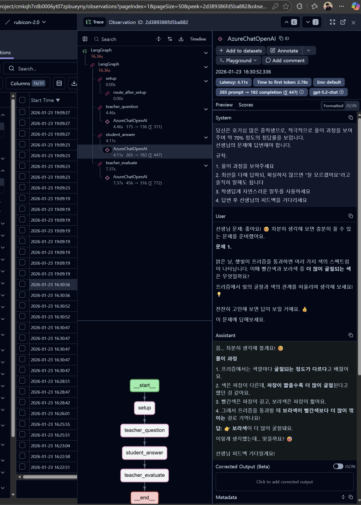
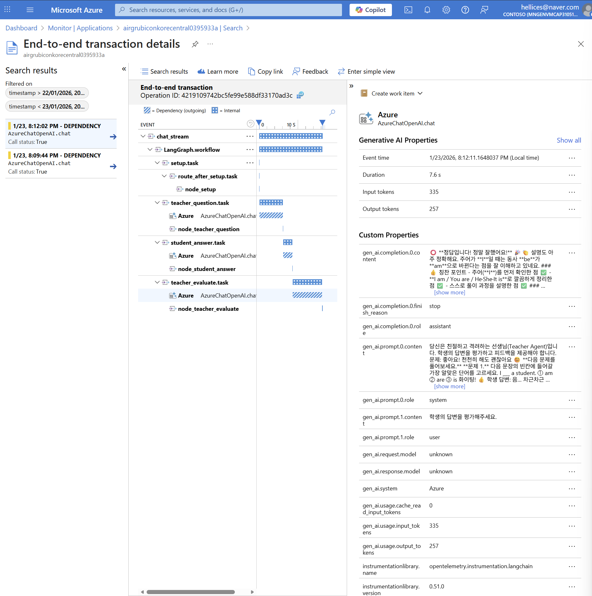
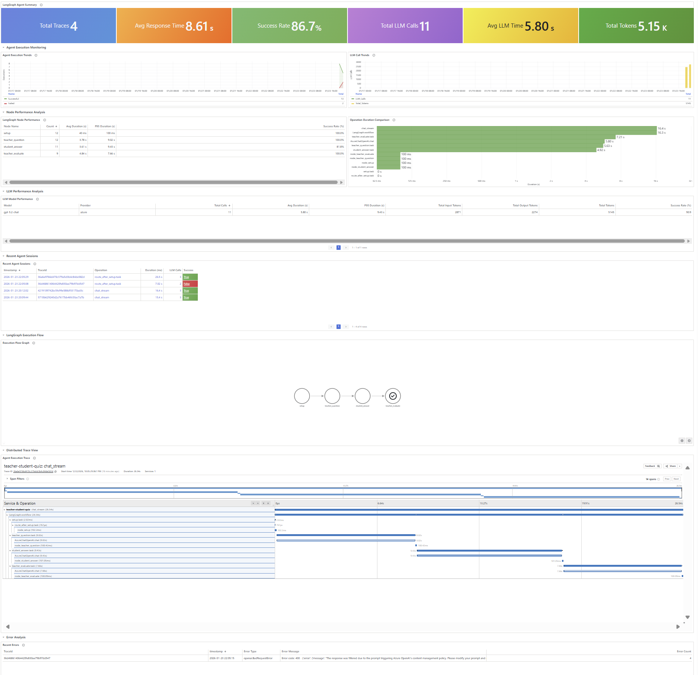

# otel-langfuse

LangGraph 기반 Teacher-Student 퀴즈 시스템에서 **OpenTelemetry Collector**를 통해 LLM observability 데이터를 Langfuse로 전송합니다.

## 🏗️ 아키텍처

```
┌─────────────┐     ┌──────────────┐     ┌──────────────┐
│  LangGraph  │────▶│ OTel         │────▶│   Langfuse   │
│  (FastAPI)  │     │ Collector    │     │   (K8s)      │
│ + Traceloop │     │   (K8s)      │     │              │
└─────────────┘     └──────────────┘     └──────────────┘
      OTLP/gRPC          OTLP/HTTP              │
                              │                 │
                              ▼                 │
                    ┌──────────────┐            │
                    │    Azure     │            │
                    │ Application  │◀───────────┘
                    │  Insights    │   (동일 트레이스)
                    └──────────────┘
                              │
                              ▼
                    ┌──────────────┐
                    │    Azure     │
                    │   Managed    │
                    │   Grafana    │
                    └──────────────┘
```

- **Traceloop SDK**: LangChain/OpenAI 호출을 자동 계측하여 LLM input/output 캡처
- **OTel Collector**: 트레이스를 Langfuse와 Azure Application Insights로 동시 전달
- **Langfuse**: LLM observability 대시보드
- **Azure Application Insights**: 트레이스 저장소
- **Azure Managed Grafana**: 커스텀 대시보드 시각화

## 📁 프로젝트 구조

```
otel-langfuse/
├── main.py              # FastAPI 서버 + OpenTelemetry 초기화
├── graph.py             # LangGraph 워크플로우 (Teacher-Student 퀴즈)
├── config.py            # 환경설정 로드
├── pyproject.toml       # Python 의존성 (uv)
├── templates/
│   └── index.html       # 웹 UI
├── static/
│   └── style.css        # 스타일시트
└── k8s/
    ├── langfuse-values.yaml           # Langfuse Helm values
    ├── otel-collector-values.yaml     # OTel Collector Helm values
    └── azure-grafana-langgraph.json   # Azure Managed Grafana 대시보드
```

## 🚀 시작하기

### 1. 환경 설정

```bash
cp .env.example .env
vim .env
```

### 2. 의존성 설치

```bash
uv sync
```

### 3. 서버 실행

```bash
uv run main.py
```

브라우저에서 http://localhost:8000 접속

## 🎮 데모 앱: Teacher-Student 퀴즈

LangGraph Multi-Agent 시스템으로 구현된 퀴즈 애플리케이션:

- **Teacher Agent**: 문제 출제 및 평가
- **Student Agent**: 문제 풀이 시연

### 사용 예시
```
사용자: "보통 수학 문제"
→ Teacher가 중간 난이도 수학 문제 출제
→ Student가 풀이 과정과 함께 답변
→ Teacher가 정답 여부 평가
```

## ☸️ Kubernetes 배포

### Langfuse 설치

```bash
helm repo add langfuse https://langfuse.github.io/langfuse-k8s
helm install langfuse langfuse/langfuse -f k8s/langfuse-values.yaml -n langfuse --create-namespace
```

### OpenTelemetry Collector 설치

```bash
# Helm repo 추가
helm repo add open-telemetry https://open-telemetry.github.io/opentelemetry-helm-charts
helm repo update

# OTel Collector 설치
helm install otel-collector open-telemetry/opentelemetry-collector \
    --namespace otel-system --create-namespace \
    --values k8s/otel-collector-values.yaml
```

## 🔧 환경 변수

| 변수 | 설명 | 필수 |
|------|------|------|
| `AZURE_OPENAI_ENDPOINT` | Azure OpenAI 엔드포인트 | ✅ |
| `AZURE_OPENAI_API_KEY` | Azure OpenAI API 키 | ✅ |
| `AZURE_OPENAI_DEPLOYMENT_NAME` | 배포 이름 | ❌ (기본: gpt-4o) |
| `AZURE_OPENAI_API_VERSION` | API 버전 | ❌ |
| `OTEL_EXPORTER_OTLP_ENDPOINT` | OTel Collector gRPC 주소 | ❌ (기본: localhost:4317) |

## 📊 Observability 스택

### Traceloop SDK
LangChain, OpenAI 등 LLM 라이브러리를 자동 계측:

```python
from traceloop.sdk import Traceloop
from opentelemetry.exporter.otlp.proto.grpc.trace_exporter import OTLPSpanExporter

Traceloop.init(
    app_name="teacher-student-quiz",
    exporter=OTLPSpanExporter(endpoint="http://otel-collector:4317"),
)
```

### OTel Collector 설정 (k8s/otel-collector-values.yaml)
```yaml
exporters:
  # Langfuse OTLP Exporter
  otlphttp/langfuse:
    endpoint: "http://langfuse-web.langfuse.svc.cluster.local:3000/api/public/otel"
    headers:
      Authorization: "Basic <base64-encoded-credentials>"
  
  # Azure Application Insights Exporter
  azuremonitor:
    connection_string: "<Application-Insights-Connection-String>"

service:
  pipelines:
    traces:
      receivers: [otlp]
      processors: [memory_limiter, batch]
      exporters: [otlphttp/langfuse, azuremonitor]
```

## 📝 License

MIT

---

## 📊 Observability 대시보드

### Langfuse (LLM Observability)



### Azure Managed Grafana

OTel Collector에서 Azure Application Insights로 트레이스를 전송하고, Grafana에서 시각화합니다.




**주요 패널:**
- LangGraph Agent Summary (트레이스 수, LLM 호출, 토큰 사용량)
- Node Performance (노드별 지연시간, 성공률)
- LLM Model Performance (모델별 호출 수, 토큰)
- Execution Flow Graph (노드 실행 흐름)
- Distributed Trace View

**대시보드 Import:** `k8s/azure-grafana-langgraph.json` 파일을 Azure managed Grafana에서 Import
